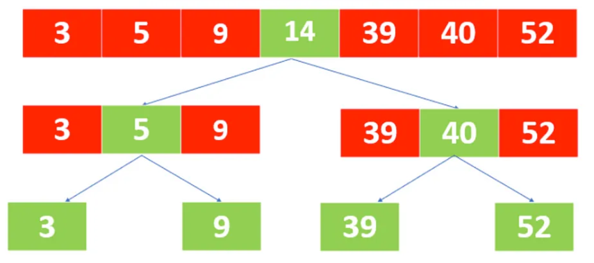

# Binary Search
Binary search is an algorithmic approach used to locate a specific element within a sorted array or list. 
It follows a divide-and-conquer strategy, repeatedly dividing the search space in half until the 
desired element is found or determined to be absent.

## Time Complexity
O(log n)

## Space Complexity
O(1)
