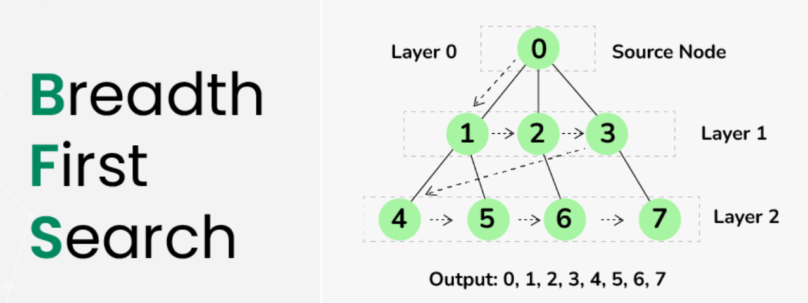

# Breadth First Search
Breadth-First Search(BFS) is an algorithm to traverse a tree or graph data structure in a breadth-ward fashion.
It won’t move toward the next-level neighbor nodes unless it has explored all it adjacent nodes at the present level. 
It uses queue to store the nodes that will be visited next and keep track of visited nodes to avoid cycles in the graph.
Therefore, BFS traverses every node/vertex and edge exactly once in a layer-wise order to find the shortest path 
between the start node and the target node.

## Time Complexity
 O(V + E) 

## Space Complexity
O(V)

- V: the total number of vertices in the graph
- E: the total number of edges in the graph
