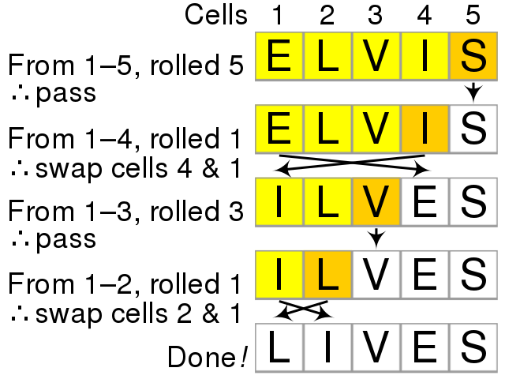

# Fisher Yates Shuffle Algorithm
he Fisher-Yates Shuffle algorithm shuffles a finite sequence of elements by generating a random permutation. 
The possibility of every permutation occurring is equally likely. The algorithm is performed by storing the elements 
of the sequence in a sack and drawing each element randomly from the sack to form the shuffled sequence.

## Time complexity
The time complexity O(N), where n is the size of the array as we traverse the array only one time to swap the elements if needed.

## Space complexity
O(1), will be the space complexity as we have taken only two variables to traverse the array and haven't used any extra data structure.

