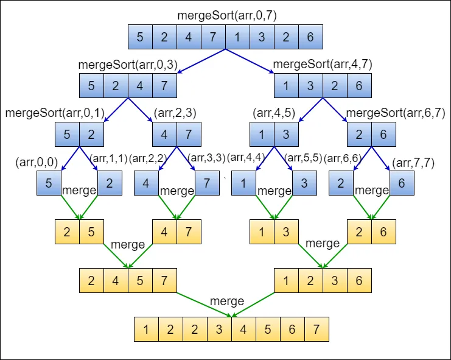

# Merge Sort
Merge sort is a divide-and-conquer algorithm that splits the input array into two halves, recursively sorts each half, and then merges the sorted halves to produce the sorted array.

## Time and Space complexity

| **Complexity**  | **Time Complexity** | **Space Complexity** |
|-----------------|---------------------|----------------------|
| Best Case       | O(n log n)     | O(n)             |
| Average Case    | O(n log n)     | O(n)             |
| Worst Case      | O(n log n)     | O(n)             |

