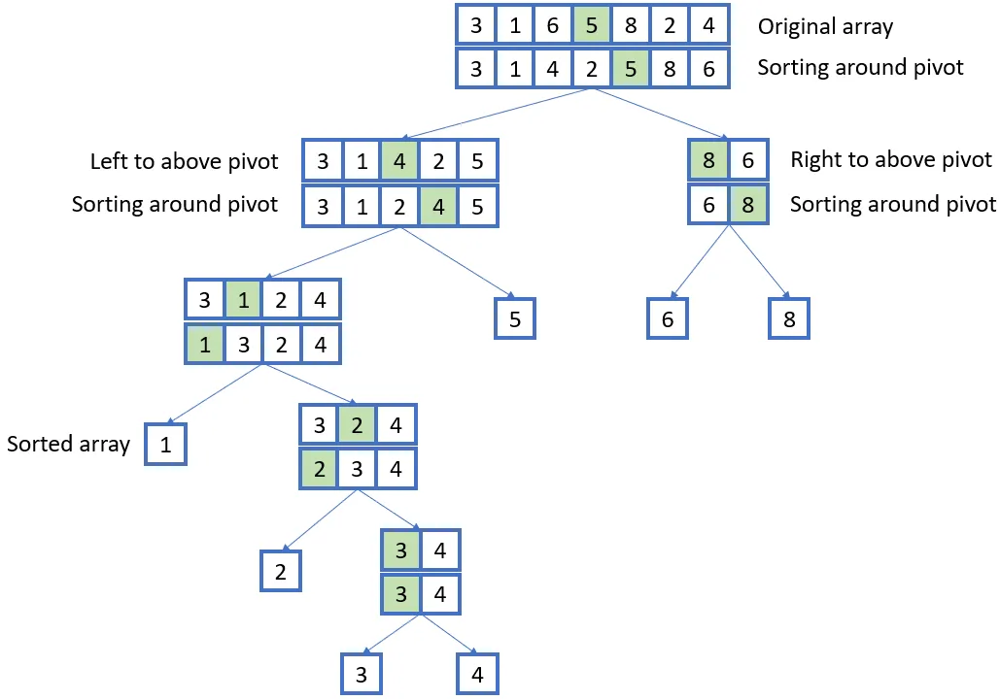

# Quick Sort
Quick Sort is a divide and conquer algorithm. It creates two empty arrays to hold elements less than the pivot value
and elements greater than the pivot value, and then recursively sort the sub arrays. There are two basic operations 
in the algorithm, swapping items in place and partitioning a section of the array.

This is the general structure of the Quick Sort algorithm. The use of Divide and Conquer can be clearly seen 
through the below diagram. Once the array has been divided into singular blocks, the array is sorted 
and all that’s left is to merge them together.

## Time Complexity
O(n logn)

## Space Complexity
- Best and Average Case: O(log n)
- Worst case: O(n)
