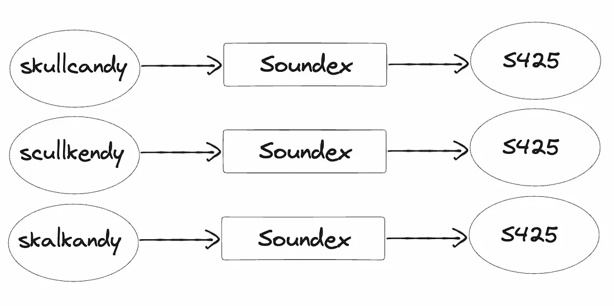

# Soundex Search
The basis of phonetic spell-check algorithms lies in the phonetic representation of words. These algorithms aim to map words
with similar pronunciations or phonetic characteristics to the same or similar representations. By doing so, they enable the 
identification and correction of spelling mistakes based on their phonetic similarity rather than their exact textual form. 
But how is this achieved?

The crucial part of the entire process is to generate a phonetic hash of a word and then compare it with the rest of them.
While different algorithms produce varied hashes, Soundex, for instance, generates a four-letter code.

The Soundex algorithm, is remarkably simple yet capable of handling challenging cases. To illustrate its effectiveness, 
Here is an example involving the brand name Skullcandy and its various phonetic errors. Given below is an image for the same.

In this example, only one spelling (skullcandy) was correct and the other two (scullkendy and skalkandy) were 
similar sounding but not correct. Interestingly, despite their differences, all three spellings share the same 
phonetic hash (S425) and hence they will be considered as the same word.

## Time Complexity
O(n)

## Space Complexity
O(n)
