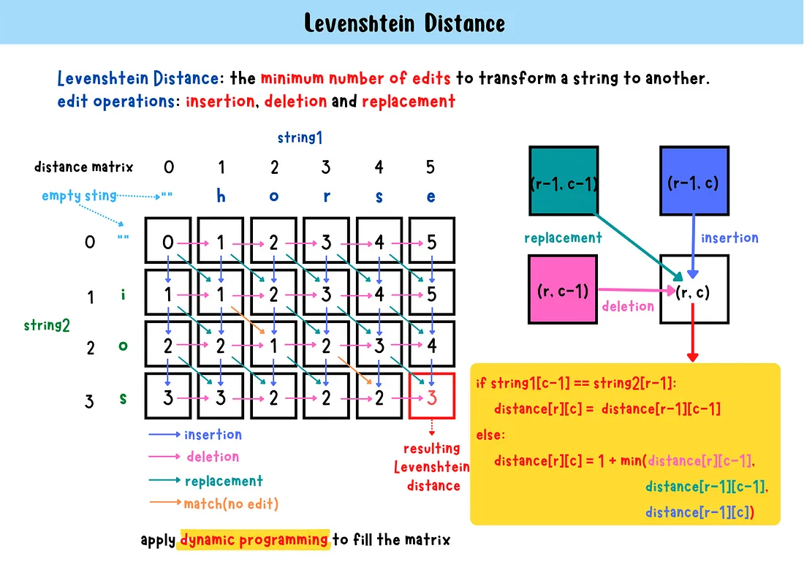

# Levenshtein distance
The Levenshtein distance between two strings represents the minimum number of edits required to convert one string to another. 
It is also called edit distance. The smaller the Levenshtein distance, the similar the strings are.

Three edit operations can be used:
    1. Insertion
    2. Deletion
    3. Replacement

We maintain a distance matrix to store the Levenshtein distance of substrings and calculate the 
Levenshtein distance using dynamic programming until we reach the bottom-right element.

## Time complexity
O(r*c)
 
## Space complexity
O(r*c)

r: the length of the string2
c: the length of the string1
